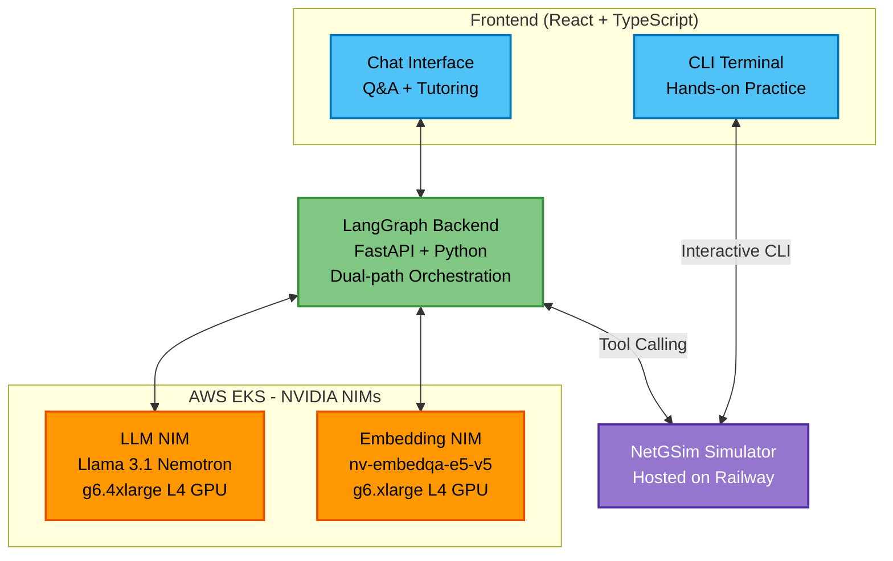
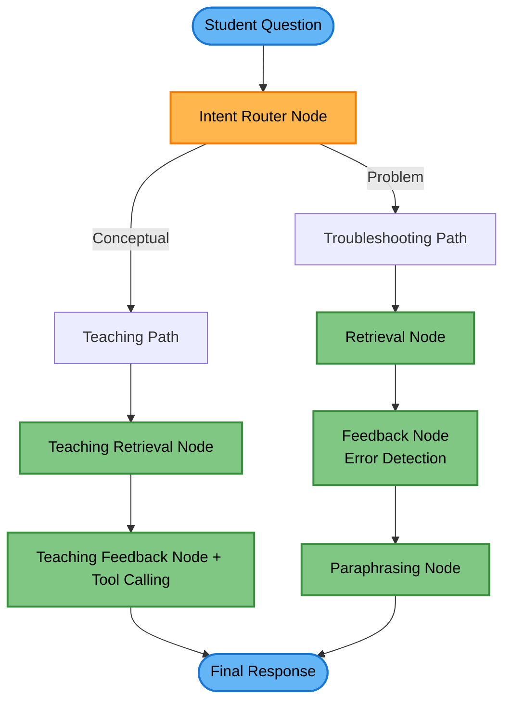

# NetGenius Tutor

## AI Networking Lab Tutor

A sophisticated multi-agent tutoring system that guides students through hands-on networking lab exercises using **LangGraph**, **RAG (Retrieval-Augmented Generation)**, and **NVIDIA NIMs**.

Built for the [**Agentic AI Unleashed**](https://nvidia-aws.devpost.com) hackathon.

## System Architecture



**Components:**

- 🔵 **Frontend**: Split into Chat Interface and CLI Terminal
- 🟢 **LangGraph Backend**: FastAPI + Python with dual-path orchestration
- 🟠 **AWS EKS NIMs**: LLM NIM and Embedding NIM with GPU specs
- 🟣 **NetGSim Simulator**: Pre-existing, propietary simulator, hosted on Railway

## Overview

This project implements an intelligent AI tutor that provides a complete learning experience for networking students:

- Dual-path intelligent routing (teaching vs troubleshooting)
- Real-time CLI error detection with fuzzy matching
- Interactive guidance through networking labs (switching, routing, IPv4/IPv6)
- RAG-powered answers from lab documentation
- Tool-calling integration with NetGSim simulator
- Real-time CLI streaming via WebSocket connection

## Try the Live Demo

**Public Demo Instance**: [https://netgenius.ai](https://netgenius.ai)

This deployed instance uses **NVIDIA-hosted NIMs** (not AWS-hosted) for easy public access without requiring infrastructure setup. It demonstrates all the core features of the tutoring system including dual-path routing, RAG retrieval, error detection, and interactive CLI simulation.

**Note for Judges**: The hackathon submission uses self-hosted NIMs on AWS EKS (see [Deployment section](#deployment-self-hosted-nims-on-aws-eks)). The public demo uses NVIDIA's hosted API endpoints for convenience and accessibility.

## LangGraph Orchestration Flow

The system uses a **dual-path LangGraph architecture** that intelligently routes questions to optimize learning outcomes:



**Key Components:**

- **RAG System**: FAISS vector store with NVIDIA Embed NIM (1024-dim embeddings)
- **LLM NIM**: NVIDIA Llama models for reasoning and explanation
- **NetGSim**: Hosted network simulator for hands-on practice
- **Error Detection**: 100+ regex patterns with fuzzy matching for typo detection

For detailed architecture documentation, see [orchestrator/README.md](orchestrator/README.md).

## Features

### 1. Dual-Path LangGraph Orchestration

The system intelligently routes student questions through two optimized paths:

**Teaching Path** (Conceptual Learning):

- Query expansion for comprehensive documentation retrieval
- Educational explanations with clear context
- Socratic method for deeper understanding
- Smart tool calling with `get_device_running_config()`

**Troubleshooting Path** (Problem Solving):

- Inline CLI error detection with fuzzy matching (100+ patterns)
- Error-aware RAG retrieval prioritizing relevant diagnostics
- Step-by-step debugging guidance
- Paraphrasing node to remove preambles and ensure concise responses

### 2. Advanced Error Detection Framework

- **100+ regex-based patterns** covering common Cisco IOS errors
- **Fuzzy matching** for typo detection (e.g., "hostnane" → "hostname")
- **Proactive CLI analysis** from recent command history
- **Mode-aware detection** (user exec vs privileged exec vs config mode)

### 3. RAG System with Smart Retrieval

- **FAISS vector store** with 1024-dimensional NVIDIA embeddings
- Automatic chunking (512 tokens, 50 token overlap)
- Lab-specific filtering and context prioritization
- Error-aware document ranking

### 4. Tool Calling with NetGSim Integration

- **Smart iteration**: Automatically gathers device configs when needed
- **Context-aware**: Skips redundant calls when CLI history is sufficient
- **Result evaluation**: Analyzes configurations to provide accurate guidance

## NetGSim Simulator

**NetGSim is a proprietary network simulator provided as a hosted service** - judges and developers do not need to deploy it.

- **Hosted at**: https://netgenius-production.up.railway.app
- **Purpose**: Provides realistic Cisco IOS CLI simulation for hands-on practice
- **Interactive CLI**: The frontend features an interactive terminal that simulates the Cisco IOS CLI
- **Integration**: The tutor calls NetGSim APIs to retrieve device configurations to ground responses

## Deployment: Self-Hosted NIMs on AWS EKS

**REQUIRED FOR HACKATHON ELIGIBILITY**

This is the primary deployment mode that demonstrates the AWS/NVIDIA integration required for hackathon judging.

**Cost**: ~$3.85/hour when running (~$62/day)

Deploys to AWS EKS with GPU nodes:

- **Embedding NIM**: g6.xlarge (16GB RAM, 1x L4 GPU)
- **LLM NIM**: g6.4xlarge (64GB RAM, 1x L4 GPU)

### Deploy Infrastructure

**Prerequisites:**

- AWS CLI configured with credentials: `aws configure`
- AWS CDK CLI installed: `npm install -g aws-cdk`
- **GPU vCPU quota increase** (required for first-time GPU deployments)

CDK will use your AWS credentials from `~/.aws/credentials` (created by `aws configure`).

**IMPORTANT: Request GPU Quota Increase First**

AWS accounts start with 0 vCPU limit for GPU instances. Request an increase before deploying:

1. Go to [AWS Service Quotas Console](https://console.aws.amazon.com/servicequotas/)
2. Search for "EC2"
3. Find "Running On-Demand G and VT instances"
4. Request quota increase to **32 vCPUs** (covers g6.xlarge + g6.4xlarge)
5. Wait for approval (usually 15 minutes - 2 hours)

```bash
cd infrastructure/ai-coach

# Create and activate Python virtual environment
python3 -m venv .venv
source .venv/bin/activate

# Install CDK and Python dependencies
pip install -r requirements.txt

# Bootstrap CDK (one-time setup per AWS account/region)
cdk bootstrap

# Deploy infrastructure (only after GPU quota is approved!)
cdk deploy
```

### Configure kubectl

```bash
aws eks update-kubeconfig \
  --name ai-coach-cluster \
  --region us-east-1
```

### Deploy NIMs

```bash
# Create NGC API key secret for NIM runtime
kubectl create secret generic ngc-api-key \
  -n nim \
  --from-literal=NGC_API_KEY=your-ngc-api-key

# Create Docker registry secret for pulling NIM images from NGC
kubectl create secret docker-registry ngc-docker-secret \
  -n nim \
  --docker-server=nvcr.io \
  --docker-username='$oauthtoken' \
  --docker-password=your-ngc-api-key

# Deploy NIMs
kubectl apply -f kubernetes/nim/embedding-nim.yaml
kubectl apply -f kubernetes/nim/llm-nim.yaml

# Monitor pod startup
kubectl get pods -n nim -w
```

**Expected startup times:**

- **Embedding NIM**: ~3-5 minutes (pod shows 1/1 ready)
- **LLM NIM**: ~10-15 minutes (pod shows 1/1 ready)

**Note**: The LLM pod will show `0/1` ready for the first 15 minutes while the model loads and initializes. This is normal - the health probes are configured with a 15-minute delay to account for model loading time. Once the pod shows `1/1` ready, the LLM NIM is fully operational.

### Getting NIM Endpoint URLs

After deploying NIMs to EKS, get the load balancer URLs:

```bash
kubectl get svc -n nim
```

**Example output:**

```
NAME        TYPE           CLUSTER-IP       EXTERNAL-IP                                                              PORT(S)          AGE
embed-nim   LoadBalancer   172.20.248.254   a74b308cf00ca46ab92b77757a183277-2e4c845811571ad6.elb.us-east-1.amazonaws.com   8000:31143/TCP   57m
llm-nim     LoadBalancer   172.20.55.34     a5b786e21ff8646e2a417ffaa0b5ca14-b24365f54b584d18.elb.us-east-1.amazonaws.com   8000:31773/TCP   57m
```

Add these URLs to your `.env` file with **port 8000** and **/v1** path:

```bash
# In .env file:
SELF_HOSTED_EMB_URL=http://a74b308cf00ca46ab92b77757a183277-2e4c845811571ad6.elb.us-east-1.amazonaws.com:8000/v1
SELF_HOSTED_LLM_URL=http://a5b786e21ff8646e2a417ffaa0b5ca14-b24365f54b584d18.elb.us-east-1.amazonaws.com:8000/v1
```

**Important**: Make sure to include:

- `http://` prefix (not https)
- `:8000` port number
- `/v1` path suffix

### Cost Management

Stop GPU nodes when not working:

```bash
# Stop nodes (saves ~$3.85/hour)
./scripts/stop-gpus.sh

# Start nodes when ready to work
./scripts/start-gpus.sh
```

### DEVELOPMENT ONLY: Hosted NIMs

**This mode is for development convenience only and does NOT comply with hackathon requirements.**

**Cost**: $0/month (FREE)

Uses NVIDIA's hosted API endpoints:

- LLM: `nvidia/llama-3.1-nemotron-nano-8b-v1`
- Embeddings: `nvidia/nv-embedqa-e5-v5`

Set `NIM_MODE=hosted` in `.env` for local development and testing only.

## Quick Start

**Note**: Before starting, ensure you've deployed the NIMs to AWS EKS as described in the [Deployment section](#deployment-self-hosted-nims-on-aws-eks) above. The following steps assume your NIMs are already running and you have the endpoint URLs.

### System Components

1. **Frontend** (React + TypeScript + Vite)

   - Modern chat interface with markdown support
   - Interactive CLI terminal
   - Lab selection and progress tracking

2. **Backend** (FastAPI + LangGraph)

   - RESTful endpoints for tutor interaction
   - LangGraph orchestrator with dual-path routing
   - RAG-powered retrieval and error detection
   - Tool calling integration with NetGSim
   - Session management and state persistence

3. **NetGSim Simulator** (Hosted Service - No deployment needed)
   - Network device simulation with Cisco IOS CLI emulation
   - WebSocket-based real-time CLI streaming
   - Device configuration API for tool calling

### Prerequisites

```bash
# Python 3.12+ for backend and orchestrator
pip install -r requirements.txt

# Node.js 18+ for frontend
cd frontend
npm install
```

### Environment Configuration

Create `.env` files in the project root and frontend directory.

**Root `.env`** (Backend + Orchestrator):

Use the NIM endpoint URLs from the deployment section above:

```bash
# NVIDIA NIM Configuration - SELF-HOSTED (AWS EKS)
NIM_MODE=self-hosted                      # REQUIRED for hackathon submission
NGC_API_KEY=your-ngc-api-key             # Required for NIM container downloads

# Self-Hosted NIM Endpoints (from kubectl get svc -n nim)
EMBED_NIM_URL=http://<embed-nim-service-EXTERNAL-IP>:8000/v1
LLM_NIM_URL=http://<llm-nim-service-EXTERNAL-IP>:8000/v1

# NetGSim Simulator (Hosted Service)
SIMULATOR_BASE_URL=https://netgenius-production.up.railway.app
```

**Frontend `.env`**:

```bash
VITE_API_BASE_URL=http://localhost:8000
VITE_SIMULATOR_WS_BASE_URL=ws://localhost:8000
```

### Running the Application

1. **Build RAG Index** (first time only):

```bash
./scripts/build-rag-index.sh
```

2. **Start Backend API**:

```bash
./start_backend.sh
# API runs on http://localhost:8000
```

3. **Start Frontend** (separate terminal):

```bash
cd frontend
npm run dev
# UI runs on http://localhost:5173
```

4. **Access the Application**:
   - Open browser to http://localhost:5173
   - Select a lab (Lab 01 or Lab 02)
   - Start learning!

## Project Structure

```
agentic-ai-unleashed/
├── README.md                           # This file
├── .env                                # Backend configuration (not in git)
├── requirements.txt                    # Python dependencies
├── start_backend.sh                    # Backend startup script
│
├── frontend/                           # React + TypeScript UI
│   ├── src/
│   │   ├── App.tsx                    # Main application component
│   │   ├── components/                # Reusable UI components
│   │   └── services/                  # API and WebSocket clients
│   ├── package.json                   # Node.js dependencies
│   ├── vite.config.ts                 # Vite configuration
│   └── .env                           # Frontend configuration
│
├── api/                                # FastAPI backend
│   └── main.py                        # REST + WebSocket endpoints
│
├── orchestrator/                       # LangGraph tutoring agent
│   ├── README.md                      # Detailed architecture docs
│   ├── docs/                          # Comprehensive documentation
│   │   ├── ARCHITECTURE.md            # Complete system analysis (860 lines)
│   │   ├── QUICK_REFERENCE.md         # Developer reference (247 lines)
│   │   └── ARCHITECTURE_DIAGRAMS.txt  # ASCII flow diagrams (309 lines)
│   ├── state.py                       # TutoringState TypedDict (40+ fields)
│   ├── nodes.py                       # 6 LangGraph node implementations
│   ├── graph.py                       # Dual-path workflow + routing
│   ├── tutor.py                       # Main tutor interface
│   ├── rag_indexer.py                 # RAG indexing pipeline
│   ├── rag_retriever.py               # RAG retrieval system
│   ├── error_detection/               # Error pattern framework
│   │   ├── patterns.py                # 100+ regex patterns + fuzzy matching
│   │   └── diagnoses.py               # Preprocessed diagnoses
│   └── paraphrasing/                  # Response cleaning
│       └── paraphraser.py             # Preamble removal agent
│
├── config/                             # NIM configuration
│   ├── README.md                      # NIM setup guide
│   └── nim_config.py                  # NIM client (self-hosted + dev mode)
│
├── data/                               # Lab content and indexes
│   ├── labs/                          # Lab documentation (markdown)
│   │   ├── 01-configure-initial-switch-settings.md
│   │   ├── 02-basic-device-configuration.md
│   │   ├── cisco-ios-command-reference.md
│   │   └── cisco-ios-error-patterns.md
│   └── faiss_index/                   # Vector store
│       ├── labs_index.faiss
│       └── labs_index_metadata.pkl
│
├── scripts/                            # Utility scripts
│   ├── build-rag-index.sh             # Build FAISS index
│   ├── test-rag-retrieval.sh          # Test RAG system
│   ├── test-tutor.sh                  # Test tutor
│   ├── test-nim-config.py             # Test NIM endpoints
│   ├── start-gpus.sh                  # Start EKS GPU nodes (self-hosted)
│   └── stop-gpus.sh                   # Stop GPU nodes (self-hosted)
│
├── infrastructure/                     # EKS deployment (optional, self-hosted)
│   └── ai-coach/                      # AWS CDK stack
│       └── ai_coach/
│           └── ai_coach_stack.py
│
└── kubernetes/                         # K8s manifests (optional, self-hosted)
    └── nim/
        ├── embedding-nim.yaml         # Embedding NIM deployment
        └── llm-nim.yaml               # LLM NIM deployment
```

## Lab Documentation

The system includes two hands-on networking labs:

### Lab 01: Configure Initial Switch Settings (Beginner)

**Duration**: ~20 minutes
**Topics**:

- Verify default switch configuration
- Configure hostname and passwords (plain text and encrypted)
- Secure console and privileged EXEC access
- Configure MOTD banners
- Save configurations to NVRAM
- Apply concepts to multiple switches

**Learning Outcomes**: Students learn fundamental Cisco IOS navigation, configuration modes, and security best practices.

### Lab 02: Basic Device Configuration (Intermediate)

**Duration**: ~45 minutes
**Topics**:

- Configure router and switch basic settings
- Set up IPv4 and IPv6 addresses on router interfaces
- Configure default gateways on PCs
- Verify end-to-end connectivity across multiple devices
- Troubleshoot configuration issues

**Prerequisites**: Completion of Lab 01
**Learning Outcomes**: Students gain experience with multi-device topologies, dual-stack networking (IPv4/IPv6), and systematic troubleshooting.

### Adding More Labs

To extend the system with additional labs:

1. Create a markdown file in `data/labs/` following the existing structure
2. Include frontmatter with metadata (id, title, difficulty, prerequisites)
3. Structure content with clear objectives, steps, and expected outcomes
4. Rebuild the RAG index: `./scripts/build-rag-index.sh`

The tutor will automatically incorporate new labs into its knowledge base.

## Technology Stack

### Frontend

- **React 18**: Modern UI framework with hooks
- **TypeScript**: Type-safe development
- **Vite**: Fast build tool and dev server
- **TailwindCSS**: Utility-first styling
- **React Markdown**: Rich text rendering

### Backend (FastAPI + LangGraph)

- **FastAPI**: High-performance async Python web framework
- **LangGraph**: Multi-agent workflow orchestration with dual-path routing
- **LangChain**: Document processing and RAG utilities
- **FAISS**: High-performance vector similarity search
- **NVIDIA NIMs**: LLM inference and embeddings
- **Pydantic**: Data validation and settings management

### Infrastructure (Optional Self-Hosted)

- **AWS EKS**: Managed Kubernetes for GPU workloads
- **AWS CDK**: Infrastructure as code in Python
- **NVIDIA GPU**: L4 GPUs for NIM inference
- **Kubernetes**: Container orchestration

### External Services

- **NetGSim**: Proprietary network simulator (Railway hosted)
- **NVIDIA API**: Hosted NIM endpoints (only for development)

## Testing

The project includes comprehensive testing for all major components:

### Integration Tests

```bash
# Build RAG index (required first time)
./scripts/build-rag-index.sh

# Test RAG retrieval system
./scripts/test-rag-retrieval.sh

# Test complete tutor workflow
./scripts/test-tutor.sh

# Test NIM configuration
python scripts/test-nim-config.py
```

### Unit Tests

```bash
# Test both teaching and troubleshooting paths
python test_both_paths.py

# Test intent classification and routing
python test_intent_classification.py

# Test fuzzy matching for error detection
python test_fuzzy_matching.py

# Test mode-aware fuzzy matching
python test_mode_aware_fuzzy.py

# Test teaching nodes specifically
python test_teaching_nodes.py
```

### Error Pattern Testing

```bash
# Test all error patterns against example outputs
python test_all_patterns.py

# Test specific pattern categories
python test_framework.py
```

## Troubleshooting

### CDK Deploy: VcpuLimitExceeded Error

**Error**: `VcpuLimitExceeded - You have requested more vCPU capacity than your current vCPU limit of 0 allows`

**Cause**: AWS accounts start with 0 vCPU limit for GPU instances (g6, p3, p4, etc.)

**Solution**:

1. Request quota increase at https://console.aws.amazon.com/servicequotas/
2. Search for "Running On-Demand G and VT instances"
3. Request at least 32 vCPUs
4. Wait for approval (15 min - 2 hours)
5. Re-run `cdk deploy` after approval

**Via CLI**:

```bash
aws service-quotas request-service-quota-increase \
    --service-code ec2 \
    --quota-code L-DB2E81BA \
    --desired-value 32 \
    --region us-east-1
```

### RAG Index Issues

```bash
# Rebuild index
rm -rf data/faiss_index
./scripts/build-rag-index.sh
```

### NIM Connection Issues

```bash
# Test hosted mode
NIM_MODE=hosted python scripts/test-nim-config.py

# Test self-hosted mode
NIM_MODE=self-hosted python scripts/test-nim-config.py
```

### EKS Deployment Issues

```bash
# Check pod status
kubectl get pods -n nim

# View logs
kubectl logs -n nim -l app=embed-nim
kubectl logs -n nim -l app=llm-nim

# Check nodes
kubectl get nodes -l nvidia.com/gpu=true
```

## License

This project is part of the Agentic AI Unleashed hackathon.

## Acknowledgments

- **NVIDIA** for free hosted NIM APIs, NGC containers, and L4 GPU infrastructure
- **LangChain/LangGraph** for powerful multi-agent orchestration and RAG utilities
- **AWS** for EKS managed Kubernetes and GPU instance types
- **Railway** for reliable hosting of the NetGSim simulator
- **Anthropic** for Claude and the Agentic AI Unleashed hackathon

## For Judges

### Understanding the Deployment Architecture

**IMPORTANT**: This project demonstrates a production AWS/NVIDIA deployment:

- **NIMs are self-hosted on AWS EKS** with Kubernetes and GPU nodes (REQUIRED for hackathon eligibility)
- **NetGSim simulator is hosted on Railway** (separate service, no deployment needed)

The distinction is important:

- **Self-hosted NIMs** = AWS EKS deployment with GPU instances = **REQUIRED for hackathon**
- **Hosted mode** = Development convenience using NVIDIA's free API = **NOT eligible for hackathon**

When `NIM_MODE=self-hosted`, the application connects to NVIDIA NIMs running on AWS EKS, demonstrating the full AWS/NVIDIA integration stack that the hackathon requires.

### Quick Evaluation Guide

**Option 1: Full Evaluation (Self-Hosted Mode - See Actual AWS Deployment)**

1. **Verify EKS Deployment**:

   ```bash
   # Check that NIMs are running on AWS EKS
   kubectl get pods -n nim
   kubectl get svc -n nim
   kubectl get nodes -l nvidia.com/gpu=true
   ```

2. **Run with Self-Hosted NIMs**:

   - Ensure `.env` has `NIM_MODE=self-hosted` with EKS load balancer URLs
   - Start backend: `./start_backend.sh`
   - Start frontend: `cd frontend && npm run dev`
   - Application will use NIMs deployed on AWS EKS

**Option 2: Quick Testing (Development Mode - Hosted API)**

For quick functional testing without AWS infrastructure access:

1. **Clone and Setup** (5 minutes):

   ```bash
   git clone <repository-url>
   cd agentic-ai-unleashed
   pip install -r requirements.txt
   cd frontend && npm install && cd ..
   ```

2. **Configure Environment** (Development mode only):

   - Get free NVIDIA API key: https://build.nvidia.com/
   - Create root `.env` with `NIM_MODE=hosted` and your API key
   - Create `frontend/.env` with API URLs (see Environment Variables section)

3. **Build RAG Index**:

   ```bash
   ./scripts/build-rag-index.sh
   ```

4. **Run Application**:

   - Terminal 1: `./start_backend.sh`
   - Terminal 2: `cd frontend && npm run dev`
   - Browser: http://localhost:5173

5. **Test Key Features**:
   - Select "Lab 01"
   - Ask: "What does the enable command do?" (teaching path)
   - Paste an error message (troubleshooting path with error detection)
   - Notice clean, concise responses

**Note**: Development mode lets you test application features quickly, but the actual hackathon submission runs on self-hosted NIMs deployed to AWS EKS with Kubernetes.

### Architecture Deep Dive

For a comprehensive understanding of the system:

- Main architecture: `orchestrator/README.md`
- Complete analysis: `orchestrator/docs/ARCHITECTURE.md` (860 lines)
- Flow diagrams: `orchestrator/docs/ARCHITECTURE_DIAGRAMS.txt`
- Quick reference: `orchestrator/docs/QUICK_REFERENCE.md`
